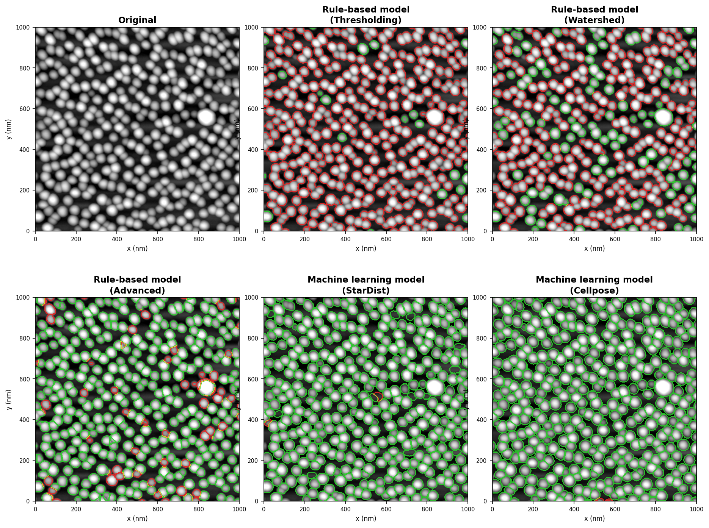

# QDSeg

**Quantum dot segmentation and statistics for AFM images (XQD format)**

[](https://www.python.org/)
[](LICENSE)

Load an XQD file, correct artefacts, detect quantum dots, and get per-grain statistics — in a few lines of Python.



---

## Install

```bash
pip install git+https://github.com/jkkwoen/qdseg.git
```

> **Python 3.12 required.** Deep-learning backends (StarDist, Cellpose) need additional extras — see [Installation](#installation) below.

---

## Quick start

```python
from qdseg import AFMData

data = AFMData("sample.xqd")
data.first_correction()
data.second_correction()
data.third_correction()
data.flat_correction("line_by_line")
data.baseline_correction("min_to_zero")

data.segment()                     # default: method='advanced'
stats = data.stats()

print(f"QDs detected : {stats['num_grains']}")
print(f"Mean height  : {stats['mean_height_nm']:.1f} nm")
```

Labels are stored internally and also returned:

```python
labels = data.segment()            # returns np.ndarray and stores as data.labels
grains = data.grains()             # list of per-grain dicts
```

To save results:

```python
from pathlib import Path
from qdseg import save_results

save_results(stats, grains,
             stats_path=Path("output/sample_stats.json"),
             grains_path=Path("output/sample_grains.csv"))
```

For custom pipelines that work directly with height/meta arrays:

```python
from qdseg import segment, calculate_grain_statistics

labels = segment(height, meta)                        # default: advanced
labels = segment(height, meta, method='watershed')
labels = segment(height, meta, method='stardist', prob_thresh=0.6)

stats = calculate_grain_statistics(labels, height, meta)
```

---

## Segmentation methods

| Method | Type | Description | Extra install |
|--------|:----:|-------------|:-------------:|
| `thresholding` | Rule-based | Simple threshold + connected components | — |
| `watershed` | Rule-based | Local maxima → watershed on Sobel gradient | — |
| `advanced` | Rule-based | Otsu threshold → distance transform → DBSCAN peaks → Voronoi | — |
| `stardist` | ML | Star-convex polygon DL (pre-trained `2D_versatile_fluo`) | `[stardist]` |
| `cellpose` | ML | Gradient-flow DL (Cellpose-SAM, v4+) | `[cellpose]` |

**Not sure which to use?** Start with `advanced` — it requires no extra install and works well for standard QD samples. Try `stardist` or `cellpose` if grain boundaries are ambiguous.

---

## Statistics returned

`calculate_grain_statistics` returns a dict:

| Key | Description |
|-----|-------------|
| `num_grains` | Grain count |
| `mean_diameter_nm` / `std_diameter_nm` | Diameter (nm) |
| `mean_area_nm2` / `std_area_nm2` | Area (nm²) |
| `mean_height_nm` / `std_height_nm` | Mean height per grain |
| `mean_height_peak_nm` | Peak height per grain |
| `mean_volume_nm3` | Volume (nm³) |
| `mean_eccentricity` / `mean_solidity` / `mean_aspect_ratio` | Shape descriptors |
| `grain_density` / `area_fraction` | Surface coverage |
| `areas_nm2`, `diameters_nm`, `orientations_rad`, … | Per-grain arrays |

---

## Installation

### Minimal (rule-based / watershed / thresholding only)

```bash
pip install git+https://github.com/jkkwoen/qdseg.git
```

### Advanced (StarDist / Cellpose)

```bash
# StarDist (TensorFlow)
pip install "qdseg[stardist] @ git+https://github.com/jkkwoen/qdseg.git"

# Cellpose
pip install "qdseg[cellpose] @ git+https://github.com/jkkwoen/qdseg.git"

# StarDist + Cellpose
pip install "qdseg[all] @ git+https://github.com/jkkwoen/qdseg.git"
```

### Apple Silicon (Mac M-series)

```bash
pip install "qdseg[mac-gpu] @ git+https://github.com/jkkwoen/qdseg.git"
```

Enables Metal (TensorFlow) and MPS (PyTorch) acceleration automatically.

### Development

```bash
git clone https://github.com/jkkwoen/qdseg.git
cd qdseg
python3.12 -m venv .venv
source .venv/bin/activate
pip install -e .
```

---

## AFM corrections

Corrections are applied in sequence to remove common AFM artefacts:

| Step | Method | Removes |
|------|--------|---------|
| `first_correction()` | Planar fit (1st-order polynomial) | Overall tilt |
| `second_correction()` | Quadratic fit | Bowl/dome background |
| `third_correction()` | Cubic fit | Higher-order curvature |
| `align_rows(method='median')` | Row-median levelling | Scan-line offset artefacts |
| `flat_correction("line_by_line")` | Line-by-line flattening | Residual line-to-line variation |
| `baseline_correction("min_to_zero")` | Shift minimum to 0 | Absolute height offset |

All corrections can be reset and re-applied:

```python
data.reset()
data.first_correction().align_rows(method='median').baseline_correction("min_to_zero")
```

`first_correction` / `second_correction` / `third_correction` accept `method='polynomial'` (default, 2-D least-squares fit) or `method='simple'` (separable row + column fit, faster).

---

## Project structure

```
qdseg/
├── qdseg/
│   ├── __init__.py          # public API
│   ├── io.py                # XQD file reader
│   ├── afm_data_wrapper.py  # AFMData class
│   ├── corrections.py       # artefact corrections
│   ├── segmentation.py      # segmentation algorithms
│   ├── statistics.py        # grain statistics
│   ├── analyze.py           # high-level pipeline
│   └── utils.py             # GPU detection
├── tests/
│   ├── test_core.py
│   └── example_usage.py
└── setup.py
```

---

## GPU support

GPU is detected and used automatically when available:

| Hardware | Backend |
|----------|---------|
| NVIDIA GPU | CUDA (PyTorch / TensorFlow / CuPy) |
| Apple Silicon | MPS (PyTorch) / Metal (TensorFlow) |
| CPU | Fallback (all methods work) |

```python
from qdseg import print_gpu_info
print_gpu_info()
```

For NVIDIA server deployment with Docker, see [GPU_DOCKER.md](GPU_DOCKER.md).

---

## License

MIT — see [LICENSE](LICENSE).

Copyright (c) 2026 jkkwoen
Contact: [jk.kwoen@gmail.com](mailto:jk.kwoen@gmail.com)
